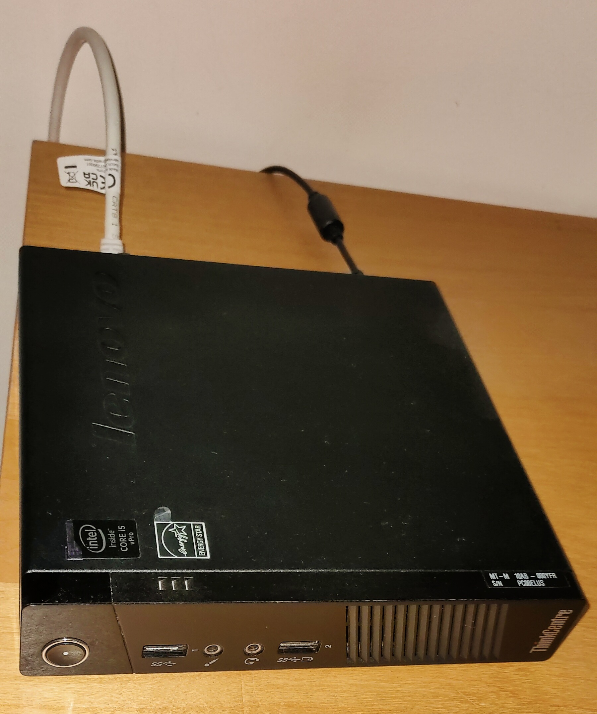
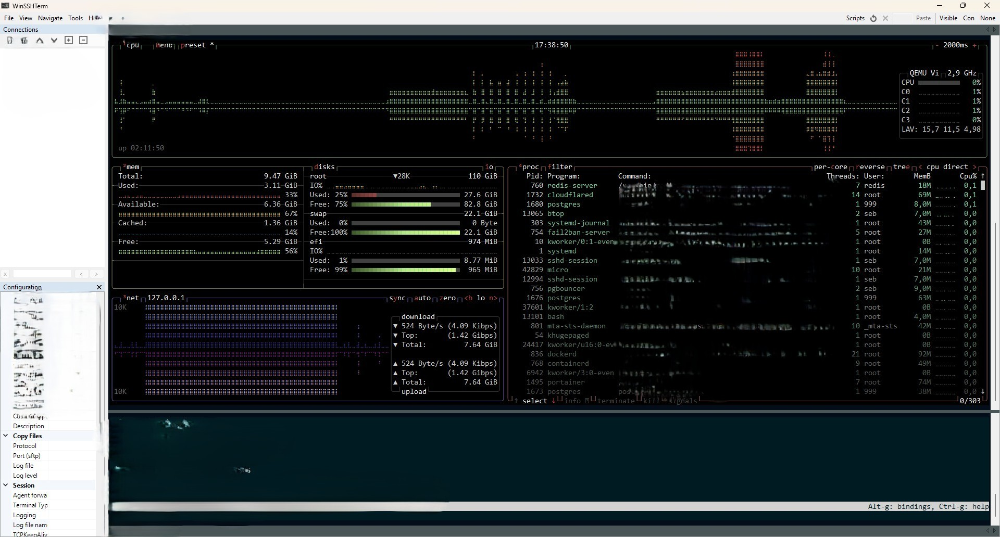
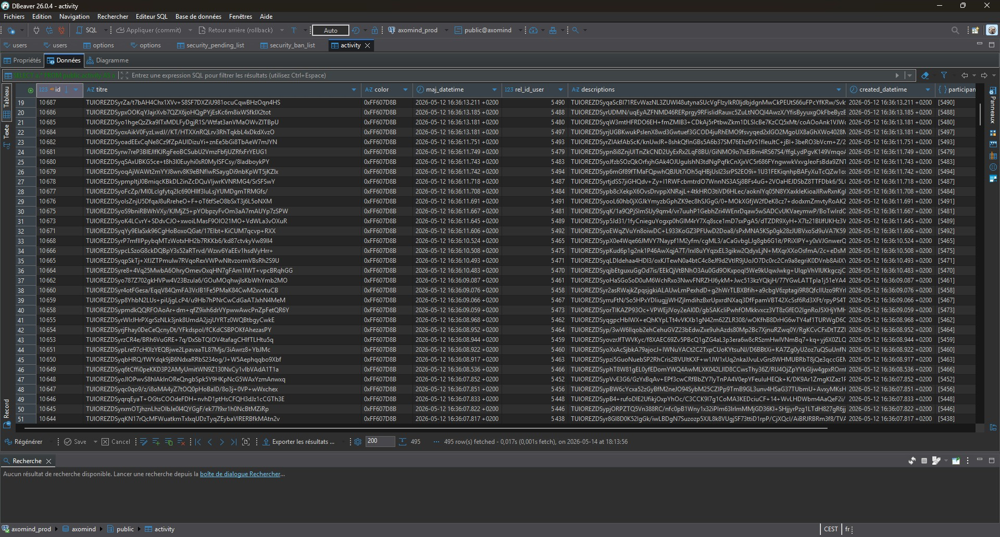

  
  <h1>Performance & Real Cost</h1>
  
<strong>Factual overview of hardware, measured load, and infrastructure costs</strong>

  
All numbers measured on production server on 2026-05-12

---

## Hardware

The full Axomind + Axovox stack runs on a single refurbished mini-PC.

  
   
  <em>Production server</em>

| Item | Value |
|---|---|
| Machine | Refurbished business mini-PC (Intel i5, ~2013) |
| CPU / RAM | 2 cores, 4 threads · 16 GB |
| Storage | SSD |
| Power envelope | 35 W TDP |
| Form factor | 17 × 17 × 3.4 cm |
| Purchase price | ~100 € (second-hand) |
| Electricity | ~8 €/month |

---

## Measured under load

Two synthetic load tests, replayed against the production server. Each test originated from a single client IP, which is a worse condition than real distributed traffic.

### Planning, mind maps and activities — 5,255 requests, 200 concurrent users in burst

| Metric | Value |
|---|---|
| Failures | 0 |
| Median (p50) | 78 ms |
| 95th percentile | 197 ms |
| 99th percentile | 568 ms |
| Throughput | ~29 req/s |
| Total duration | 183 s |

### Messaging — 3,691 requests, 200 concurrent users in burst

| Metric | Value |
|---|---|
| Failures | 0 |
| Median (p50) | 109 ms |
| 95th percentile | 196 ms |
| 99th percentile | 240 ms |
| Total duration | 120 s |

CPU peaked around 80 % per core during the burst; memory and disk usage remained well within limits.

  
   
  <em>System metrics captured during the peak of the burst test</em>

---

## Capacity estimate

| Profile | Capacity |
|---|---|
| Concurrent active users (normal usage) | ~600 |
| Total daily users (with realistic turnover) | ~2,000 |

In normal usage, an active user generates roughly one to two small requests per minute — an order of magnitude below the burst test rate.

---

## Cost comparison

| Setup | Per month | Per year | Over 5 years |
|---|---:|---:|---:|
| Self-hosted (current capacity) | ~8 € | ~96 € | ~480 € |
| AWS equivalent (t3.large / m5.large class) | ~60–70 € | ~720–840 € | ~3,600–4,200 € |
| Self-hosted, scaled to ~15,000 concurrent users (multi-machine cluster) | ~30 € | ~360 € | ~1,800 € |
| AWS equivalent at that scale | ~600 € | ~7,200 € | ~36,000 € |

Across both scenarios, the self-hosted setup runs at roughly 85–95 % below the cost of the equivalent managed instance.

---

## Architecture choices that keep the load low

- The client keeps a local copy of the data and reads it directly; the server is only contacted for what has actually changed since the last sync.
- An in-memory cache sits in front of the database, so most reads never reach the disk.
- Deletions are propagated as small markers, so clients clean up locally without a full re-sync.

---

## Encryption at rest (observable)

Sensitive text fields (titles, descriptions, message bodies, mind map nodes) are encrypted with AES-256-GCM before being written to the database. Even with direct SQL access to the production database, the stored values are ciphertext — the plain text is never visible at the storage layer.

  
   
  <em>Direct SQL view of the production database — title and description columns hold ciphertext only.</em>

---

## Reproducibility and observability

- The load tests are scripted and can be re-run on demand against the production server.
- Server health is monitored live (CPU, memory, cache hit rate).
- The codebase includes 847 automated tests (680 client-side + 167 server-side across 106 test files) and a CI/CD pipeline with format check, static analysis, unit tests, integration tests and multi-platform builds that run on every change, plus benchmark scripts for server-side load and DevTools-based profiling on the client side (CPU, GPU, memory).

> The cost is a realistic estimate based on the hardware's measured power draw; the latencies are what the load tests produced.

---

## Version Française

Cliquez pour lire en français

---

## Matériel

L'ensemble de la stack Axomind + Axovox tourne sur un seul mini-PC reconditionné.

  
   
  <em>Serveur de production</em>

| Élément | Valeur |
|---|---|
| Machine | Mini-PC de bureau reconditionné (Intel i5, ~2013) |
| CPU / RAM | 2 cœurs, 4 threads · 16 Go |
| Stockage | SSD |
| Enveloppe énergétique | 35 W TDP |
| Format | 17 × 17 × 3,4 cm |
| Prix d'achat | ~100 € (occasion) |
| Électricité | ~8 €/mois |

---

## Mesuré sous charge

Deux tests de charge synthétiques, rejoués contre le serveur de production. Chaque test était émis depuis une seule IP cliente, ce qui est une condition plus défavorable qu'un trafic réel distribué.

### Planning, cartes mentales et activités — 5 255 requêtes, 200 utilisateurs simultanés en burst

| Métrique | Valeur |
|---|---|
| Échecs | 0 |
| Médiane (p50) | 78 ms |
| 95e percentile | 197 ms |
| 99e percentile | 568 ms |
| Débit | ~29 req/s |
| Durée totale | 183 s |

### Messagerie — 3 691 requêtes, 200 utilisateurs simultanés en burst

| Métrique | Valeur |
|---|---|
| Échecs | 0 |
| Médiane (p50) | 109 ms |
| 95e percentile | 196 ms |
| 99e percentile | 240 ms |
| Durée totale | 120 s |

Le CPU a culminé à environ 80 % par cœur pendant le burst ; mémoire et disque sont restés largement sous leurs limites.

  
   
  <em>Métriques système capturées au pic du test de charge</em>

---

## Capacité estimée

| Profil | Capacité |
|---|---|
| Utilisateurs actifs simultanés (usage normal) | ~600 |
| Total utilisateurs par jour (avec rotation réaliste) | ~2 000 |

En usage normal, un utilisateur actif génère environ une à deux petites requêtes par minute — un ordre de grandeur en dessous du débit du burst test.

---

## Comparaison de coût

| Configuration | Par mois | Par an | Sur 5 ans |
|---|---:|---:|---:|
| Autohébergé (capacité actuelle) | ~8 € | ~96 € | ~480 € |
| Équivalent AWS (classe t3.large / m5.large) | ~60–70 € | ~720–840 € | ~3 600–4 200 € |
| Autohébergé, monté à ~15 000 utilisateurs simultanés (cluster multi-machines) | ~30 € | ~360 € | ~1 800 € |
| Équivalent AWS à cette échelle | ~600 € | ~7 200 € | ~36 000 € |

Sur les deux scénarios, la configuration autohébergée tourne à environ 85–95 % en dessous du coût de l'instance gérée équivalente.

---

## Choix d'architecture qui maintiennent la charge basse

- Le client garde une copie locale des données et la lit directement ; le serveur n'est contacté que pour ce qui a effectivement changé depuis la dernière synchronisation.
- Un cache en mémoire vive est placé devant la base de données, donc la plupart des lectures ne touchent jamais le disque.
- Les suppressions sont propagées sous forme de petits marqueurs : les clients nettoient en local sans re-synchronisation complète.

---

## Chiffrement au repos (observable)

Les champs texte sensibles (titres, descriptions, contenu des messages, nœuds de cartes mentales) sont chiffrés en AES-256-GCM avant d'être écrits en base de données. Même avec un accès SQL direct à la base de production, les valeurs stockées sont du chiffré — le texte clair n'apparaît jamais à la couche stockage.

  
   
  <em>Vue SQL directe de la base de production — les colonnes titre et description ne contiennent que du chiffré.</em>

---

## Reproductibilité et observabilité

- Les tests de charge sont scriptés et peuvent être rejoués à la demande contre le serveur de production.
- La santé du serveur est surveillée en direct (CPU, mémoire, taux de hit du cache).
- Le code embarque 847 tests automatisés (680 côté client + 167 côté serveur dans 106 fichiers de test) et un pipeline CI/CD avec vérification de format, analyse statique, tests unitaires, tests d'intégration et builds multi-plateforme qui tournent à chaque changement, plus des scripts de benchmark côté serveur et du profiling via DevTools côté client (CPU, GPU, mémoire).

> Le coût est une estimation réaliste basée sur la consommation électrique mesurée du matériel ; les latences sont les valeurs produites par les tests de charge.

---

**Last updated:** 2026-08-22
