

  
  <h1>Axomind</h1>
  
<strong>Plan projects, map ideas, and message your team — encrypted, self-hosted.</strong>

  
  

    
  

  

    
    
  

  

    
  

---

## 🚀 Get the Latest Version

  <table>
    <tr>
      <td align="center" width="33%">
        
         
        APK • <a href="INSTALL_ANDROID.md">Installation guide</a>
      </td>
      <td align="center" width="33%">
        
         
        ZIP • <a href="INSTALL_WINDOWS.md">Installation guide</a>
      </td>
      <td align="center" width="33%">
        
         
        Debian 13 • <a href="INSTALL_LINUX.md">Installation guide</a>
      </td>
    </tr>
  </table>

  

## 🎥 Preview

Two clips recorded during a live test with three workstations on the same instance.

  <a href="https://github.com/Sebastien-VZN/axomind/raw/main/image/test1_compressed.mp4">
    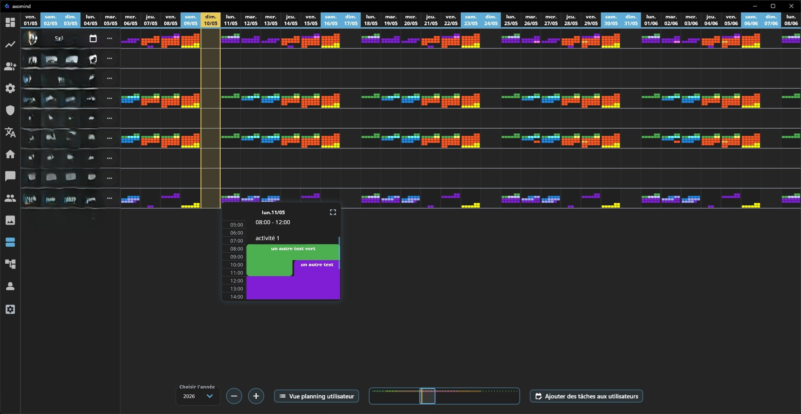
  </a>
  <a href="https://github.com/Sebastien-VZN/axomind/raw/main/image/test2_compressed.mp4">
    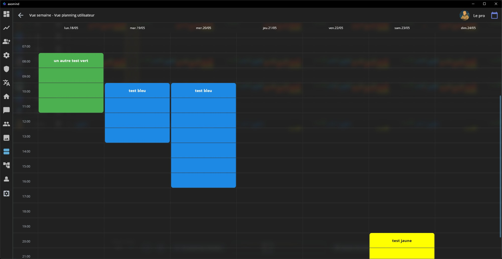
  </a>

<em>▶ Click any thumbnail to watch the video</em>

---

## 📋 Table of Contents

- [⚠️ Project Status](#️-project-status-beta-version)
- [✨ Key Features](#-key-features)
- [💻 Supported Platforms](#-supported-platforms)
- [🎨 Gallery](#-gallery)
- [📊 Performance & Real Cost](#-performance--real-cost)
- [🔒 Security](#-security)
- [🤖 Bot API](#-bot-api)
- [🌐 About Axovox](#-about-axovox)
- [🟢 Server Status](#-server-status)
- [🤝 Bug Reports & Feedback](#-bug-reports--feedback)
- [📜 Changelog](#-changelog)
- [🛣️ Roadmap & Future of the Project](#️-roadmap--future-of-the-project)
- [👤 Author](#-author)
- [🇫🇷 Version Française](#-version-française)

---

## ⚠️ Project Status: Beta Version

> This project is in active development. Bugs and unexpected behaviors are likely. Feedback is welcome.

> **📧 About emails**
> Email-based features (account verification, password reset, 2FA) are currently disabled. Accounts work without any email step.

---

## ✨ Key Features

**🗓️ Project Planning**
- 🗓️ **Timeline Planner** — Annual Gantt chart to plan tasks, projects and team resources
- 👥 **Multi-User Views** — Display by person or by activity, filters, search by date and user
- 🔄 **Quick Add** — Create tasks and slots directly from the planning view, with drag-and-drop
- 📋 **Kanban Board** — Organize work with boards, columns and cards; drag-and-drop reordering, real-time sync, inline card editing *(being finalized)*

**🧠 Knowledge & Ideas**
- 🧠 **MindMap** — Structured mind maps with customizable nodes, connections and styles
- 🎨 **Recursive Styling** — Colors and borders applied to a node carry over to its sub-nodes automatically
- 🔗 **Contextual Linking** — Each mind map can be linked to a conversation or project

**💬 Contextual Communication**
- 💬 **Contextual Messaging** — Each conversation is linked to a task, project or mind map
- 🔒 **Strong Encryption** — Messages and files are encrypted with AES-256-GCM, both when stored on the server and while being sent
- ⚡ **Real-Time** — Instant delivery, with automatic reconnection if the link drops
- 🛡️ **Two-factor authentication** — Email-code 2FA with anti-spam and bad-attempt detection (currently disabled).
- 🎤 **Audio Messages** — Record and send voice clips
- 📎 **File Sharing** — Up to 10 files per message (10 MB each)
- ⏱️ **Retention** — Messages kept 1 year on the server / 2 years locally, with optional 24h auto-delete · Files kept 1 month (3 months if pinned)

**🎨 Interface & Experience**
- 🎨 **26 Themes** — Each with a light and a dark variant, switchable on the fly, with Aurora animations and glassmorphism
- 📱 **Multi-Device** — Stay signed in on up to **4 devices at once**: desktop and mobile for Axomind, plus desktop and mobile for Axovox, all in parallel
- 🌍 **33 Languages** — Full UI translation with native language flags, including English, French, German, Spanish, Portuguese, Italian, Russian, Chinese, Japanese, Korean, Arabic, Hindi and 21 more

**🧩 Integrations**
- 🤖 **Bot API** — Send messages from CI/CD, monitoring, or automation tools (n8n, Make, Zapier...)

---

🛠️ <strong>Tech Stack</strong> — for the curious

 

  
  
  
  
  
  

**How it works (in plain words):**
1. **The app** talks to the server over a secure connection (HTTPS), and a separate live channel keeps everything in sync in real time
2. **The live channel** can keep up to 4 sessions open at once for the same account — desktop and mobile for Axomind, plus desktop and mobile for Axovox
3. **The server** protects accounts on several layers: route checks, attack protection, AES-256-GCM encryption, and a unique token per session
4. **The database** stores everything encrypted, keeps data only as long as needed, and is tuned for fast reads on the planning, mind maps, and messages

---

## 💻 Supported Platforms

| Platform | Status                 |
|:--------:|:-----------------------|
| Android  | ✅ Supported           |
| Windows  | ✅ Supported           |
| Linux    | ✅ Supported           |
| macOS    | ❌ Not yet supported   |
| iOS      | ❌ Not yet supported   |

---

## 🎨 Gallery

  
  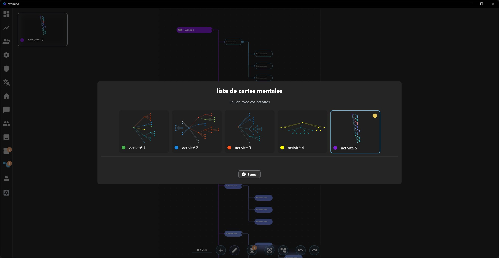

Gantt week view (left) · Annual calendar, dark theme (right)

  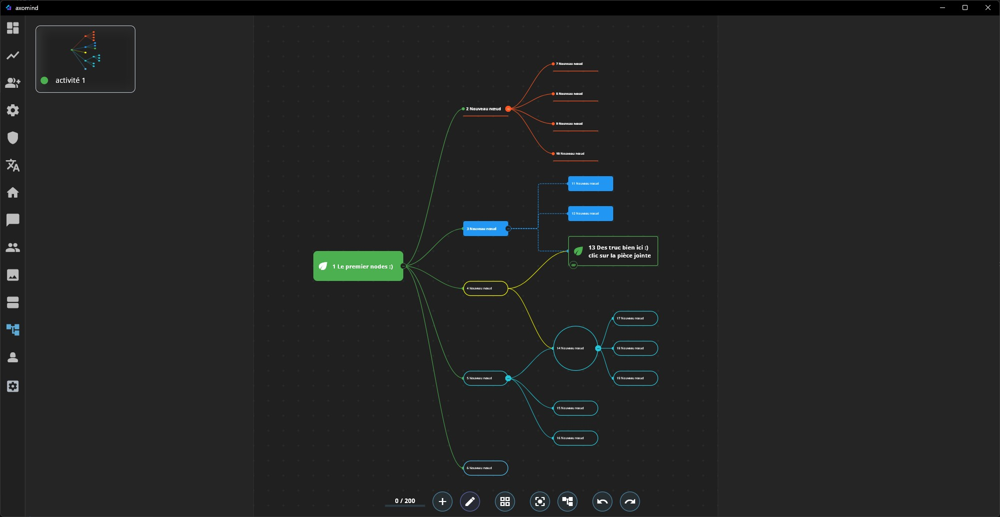
  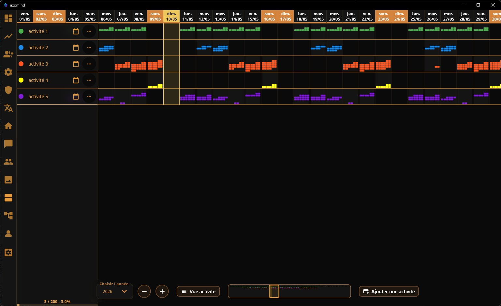

Activity planning, light theme (left) · Dark theme (right)

📸 More screenshots — Gantt details, themes, light & dark variants

### 📅 Timeline Planner — Annual Gantt Planning

  
  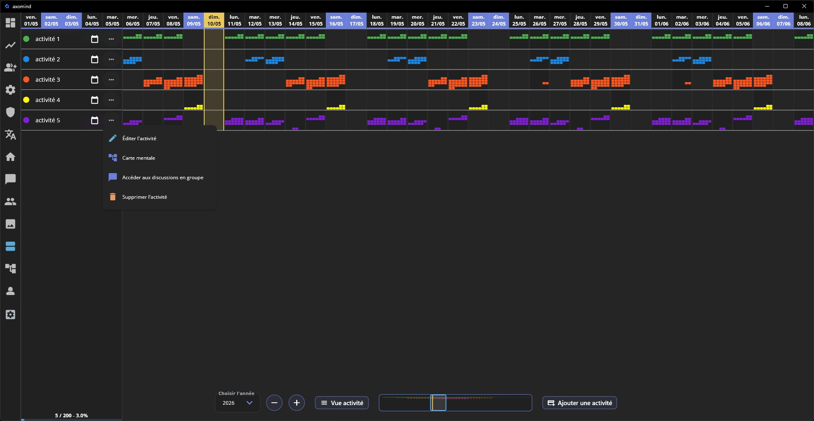

  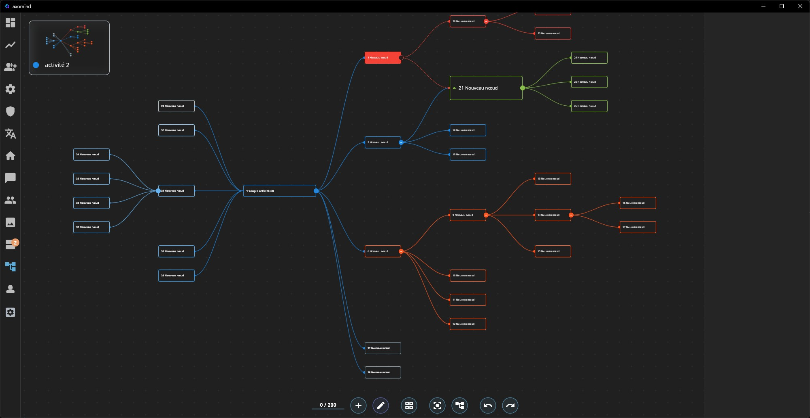
  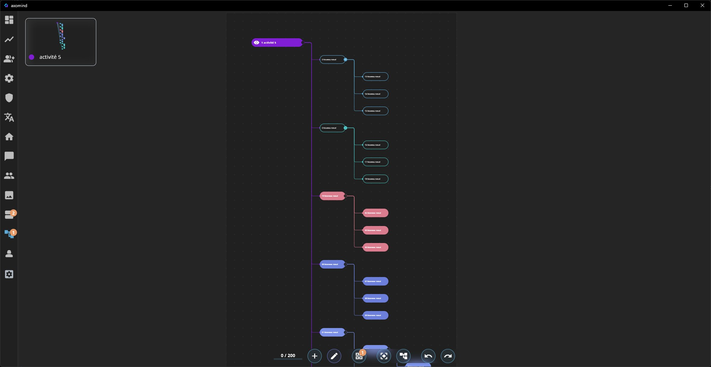

### 🎨 Activity Views & Theme System (26 themes, light + dark)

  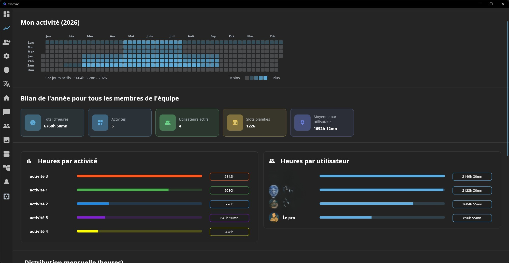
  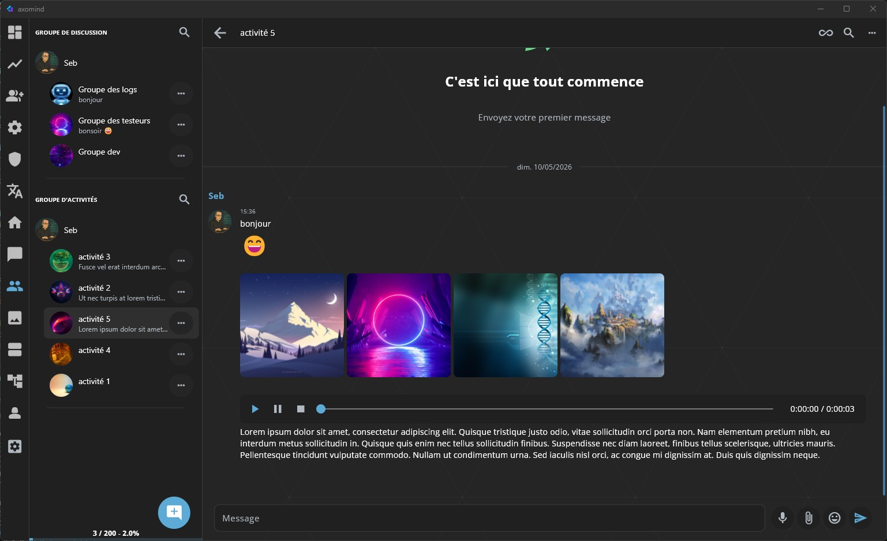

  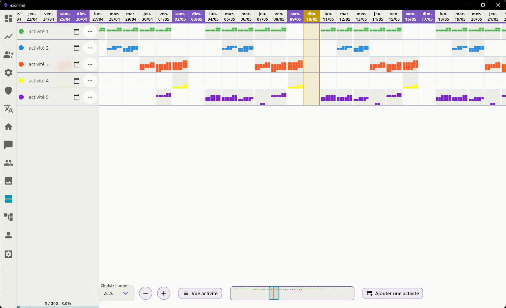
  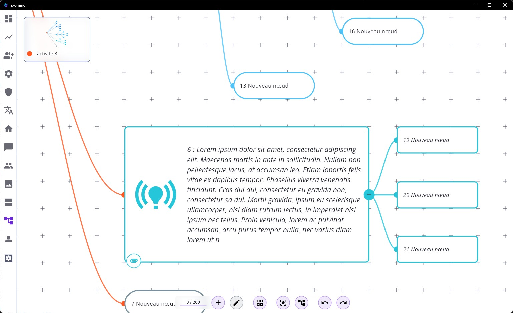

  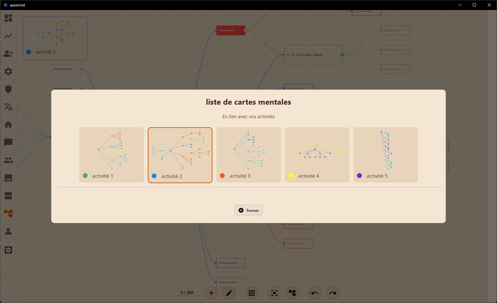
  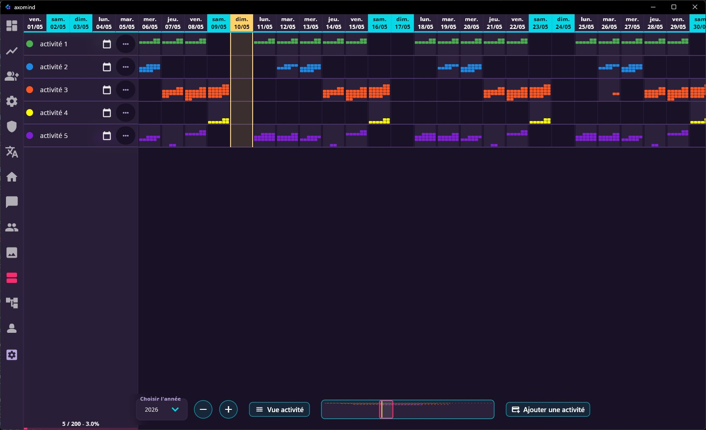
  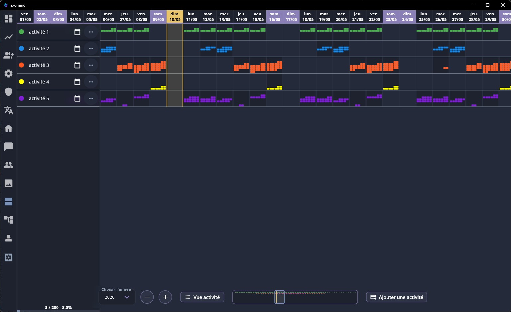

---

## 📊 Performance & Real Cost

Hardware specs, load test results (200 users burst, 0 failures) and infrastructure cost analysis.

→ **[Read detailed analysis](PERF.md)**

---

## 🔒 Security

Axomind is built with a "security by default" philosophy. Native desktop and mobile application (no web), self-hosted behind Cloudflare tunnels, strict firewall, encrypted data at rest, and a built-in anti-brute-force engine that permanently bans malicious IPs.

→ **[Read the full security overview](SECURITY.md)**

---

## 🤖 Bot API

  

Send automated messages into any conversation from your CI/CD, monitoring, or automation tools (n8n, Zapier, Make...). → **[Full documentation](API_BOT.md)**

---

## 🌐 About Axovox

  

**Axovox** is the **communication module** powering Axomind's real-time messaging. Built on the same custom Flutter framework, Axovox has been integrated into Axomind as the contextual communication layer. It is also available as a **standalone messaging application** for teams who need private encrypted communication without the full Axomind suite.

  

🧩 Custom Modular Framework

 

Both apps run on a **custom modular framework** built around a few simple rules:
* **Modular** — the interface, the logic, and the services stay independent of one another
* **Flexible** — pieces work together without being tied together
* **Context-aware** — the app adapts to the user and the device
* **Clean layers** — interface, logic, data, and settings each live in their own layer

---

## 🟢 Server Status

  
  
Check the live status of Axomind services

---

## 🤝 Bug Reports & Feedback

Axomind is in beta. Bug reports, feature ideas and general feedback are welcome — open an issue on the repository (GitHub account required), every entry is read and considered.

The application source code is proprietary and kept private as a deliberate security choice. This public repository contains the documentation, install guides and release builds — not the codebase. External code contributions aren't part of the project model.

---

## 📜 Changelog

All notable releases are documented in [CHANGELOG.md](CHANGELOG.md) ([version française](CHANGELOG_FR.md)).

---

## 🛣️ Roadmap & Future of the Project

### Current hosting, a deliberate choice

The full stack (Axomind + Axovox) currently runs on a single self-hosted refurbished mini-PC. This isn't an ideological stance. It's the result of architecture decisions that pushed energy efficiency to roughly **85–90% below an equivalent managed cloud setup**, as detailed in the [performance analysis](PERF.md).

What comes next is mostly a question of funding. The business plan is in place, it just needs the means. As soon as the first funds arrive, production will move to a hosting provider. In the meantime, self-hosting keeps production running.

### Driven by real usage

Axomind is my daily tool. I plan, communicate and coordinate all my work inside it, at my own scale. Every feature was born from real usage, from an actual friction or a genuinely observed gap, never from a roadmap written far from the field. That's dogfooding, practiced at my level, and it's what keeps the project grounded.

What I am looking for now is eyes other than mine. Feedback from people who plan and coordinate work daily is precious, because it says far more than my intuition ever will. Serious collaborators are more than welcome to help decide which features truly change the daily routine.

### A foundation built, evolving with experience

The base is built and working. The Kanban board is operational (boards, columns, cards, drag-and-drop, real-time sync) and will keep gaining polish as experience accumulates. Client-side quota management has been rebuilt around subscription plan parameters. The Axovox messaging fork is being restructured, with shared modules migrating over. The in-house forks of `flutter_quill` and `native_spell_checker` are live, with hardening continuing on clipboard edge cases and spell check coverage.

There is still work ahead, but it consists of relevant additions driven by experience, not unfinished construction.

### AI in the project

AI has a real place in how this project is built, under one explicit rule. Every decision and every line of integration is supervised. No vibe coding. The AI proposes, I decide, the tests arbitrate. Over 800 automated tests and a full CI/CD pipeline (static analysis, unit and integration tests, multi-platform builds, load benchmarks) are the factual standard every AI-assisted change is validated against.

The application itself uses no AI by default. What exists today is an MCP server built on top of the Bot API, which lets any MCP-compatible client (Hermes, opencode, Claude Desktop, Cursor) interact with Axomind resources where a bot is assigned. The MCP server repository is at [github.com/Sebastien-VZN/axomind-mcp](https://github.com/Sebastien-VZN/axomind-mcp), and the Bot API is fully documented in [API_BOT.md](API_BOT.md), 3 routes and 13 actions with code examples.

The AI copilot, for its part, remains an idea under study, one that will also depend on funding. The idea is that each user can activate it under the permissions established with them, and that AI then acts as a copilot across the application. The MCP server, already in place, will keep evolving over time.

---

## 👤 Author

  

---

## 🇫🇷 Version Française

  
  <h1>Axomind</h1>
  
<strong>Planifiez vos projets, cartographiez vos idées, échangez avec votre équipe — chiffré, autohébergé.</strong>

## ⚠️ Statut du projet : Version Beta

> Ce projet est en développement actif. Des bugs et comportements inattendus sont probables. Les retours sont bienvenus.

> **📧 À propos des emails**
> Les fonctionnalités liées à l'email (vérification de compte, réinitialisation de mot de passe, 2FA) sont actuellement désactivées. Les comptes fonctionnent sans étape email.

---

## 🎥 Aperçu

Deux clips enregistrés pendant un test live avec trois postes connectés à la même instance.

  
  

<em>▶ Cliquez sur une vignette pour lancer la vidéo</em>

---

## ✨ Fonctionnalités Clés

**🗓️ Planification de Projet**
- 🗓️ **Timeline Planner** — Diagramme Gantt annuel pour planifier tâches, projets et ressources de l'équipe
- 👥 **Vues Multi-Utilisateurs** — Affichage par personne ou par activité, filtres, recherche par date et utilisateur
- 🔄 **Ajout Rapide** — Création de tâches et créneaux directement depuis la vue planning, avec glisser-déposer
- 📋 **Tableau Kanban** — Organisez le travail avec boards, colonnes et cartes ; glisser-déposer, synchronisation temps réel, édition en ligne des cartes *(en cours de finalisation)*

**🧠 Connaissances & Idées**
- 🧠 **MindMap** — Cartes mentales structurées avec nodes, connexions et styles personnalisables
- 🎨 **Style Récursif** — Les couleurs et bordures appliquées à un nœud se reportent automatiquement à ses sous-nœuds
- 🔗 **Lien Contextuel** — Chaque mindmap peut être liée à une conversation ou un projet

**💬 Communication Contextuelle**
- 💬 **Messagerie Contextuelle** — Chaque conversation est liée à une tâche, un projet ou une carte mentale
- 🔒 **Chiffrement fort** — Messages et fichiers chiffrés en AES-256-GCM, à la fois sur le serveur et lors de l'envoi
- ⚡ **Temps Réel** — Livraison instantanée, avec reconnexion automatique en cas de coupure
- 🛡️ **Double authentification** — 2FA par code email avec anti-spam et détection des tentatives suspectes (désactivée pour le moment).
- 🎤 **Messages Audio** — Enregistrement et envoi de clips vocaux
- 📎 **Partage de Fichiers** — Jusqu'à 10 fichiers par message (10 Mo chacun)
- ⏱️ **Rétention** — Messages conservés 1 an sur le serveur / 2 ans en local, avec suppression automatique optionnelle après 24h · Fichiers conservés 1 mois (3 mois si épinglé)

**🎨 Interface & Expérience**
- 🎨 **26 Thèmes** — Chacun avec une variante claire et une sombre, interchangeables à la volée, avec animations Aurora et glassmorphism
- 📱 **Multi-Appareils** — Restez connecté sur **4 appareils en même temps** : desktop et mobile pour Axomind, plus desktop et mobile pour Axovox, tous en parallèle
- 🌍 **33 Langues** — Traduction complète de l'interface avec drapeaux natifs, incluant anglais, français, allemand, espagnol, portugais, italien, russe, chinois, japonais, coréen, arabe, hindi et 21 autres

**🧩 Intégrations**
- 🤖 **API Bot** — Envoyez des messages depuis vos outils CI/CD, monitoring ou plateformes d'automatisation (n8n, Make, Zapier...)

---

🛠️ <strong>Stack Technologique</strong> — pour les curieux

 

  
  
  
  
  
  

**Fonctionnement (en clair) :**
1. **L'application** dialogue avec le serveur via une connexion sécurisée (HTTPS), et un canal temps réel séparé garde tout synchronisé en direct
2. **Le canal temps réel** peut maintenir jusqu'à 4 sessions ouvertes en même temps pour un même compte — desktop et mobile pour Axomind, plus desktop et mobile pour Axovox
3. **Le serveur** protège les comptes sur plusieurs niveaux : vérifications des accès, protection contre les attaques, chiffrement AES-256-GCM, et un jeton unique par session
4. **La base de données** stocke tout de façon chiffrée, ne conserve les données que le temps utile, et est optimisée pour des lectures rapides sur le planning, les cartes mentales et les messages

---

## 💻 Plateformes supportées

| Plateforme | Statut                         |
|:----------:|:-------------------------------|
| Android    | ✅ Supporté                    |
| Windows    | ✅ Supporté                    |
| Linux      | ✅ Supporté                    |
| macOS      | ❌ Non supporté pour le moment |
| iOS        | ❌ Non supporté pour le moment |

---

## 🎨 Galerie

  
  

Vue Gantt semaine (gauche) · Calendrier annuel, thème sombre (droite)

  
  

Planning activité, thème clair (gauche) · Thème sombre (droite)

📸 Plus de captures — détails Gantt, thèmes, variantes clair & sombre

### 📅 Timeline Planner — Planification Gantt Annuelle

  
  

  
  

### 🎨 Vues Activité & Système de Thèmes (26 thèmes, clair + sombre)

  
  

  
  

  
  
  

---

## 📊 Performance & Coût Réel

Spécifications matériel, résultats des tests de charge (200 users burst, 0 échec) et analyse des coûts d'infrastructure.

→ **[Lire l'analyse détaillée](PERF.md)**

---

## 🔒 Sécurité

Axomind est conçu avec une philosophie de « sécurité par défaut ». Application native desktop et mobile (pas de web), autohébergée derrière des tunnels Cloudflare, pare-feu strict, données chiffrées au repos, et un moteur anti-brute-force intégré qui bannit définitivement les IP malveillantes.

→ **[Lire la présentation sécurité complète](SECURITY.md)**

---

## 🤖 API Bot

  

Envoyez des messages automatisés dans vos conversations depuis vos outils CI/CD, monitoring ou plateformes d'automatisation (n8n, Zapier, Make...). → **[Documentation complète](API_BOT.md)**

---

## 🌐 À propos d'Axovox

  

**Axovox** est le **module de communication** qui alimente la messagerie temps réel d'Axomind. Construit sur le même framework Flutter personnalisé, Axovox a été intégré à Axomind comme couche de communication contextuelle. Il est également disponible comme **application de messagerie autonome** pour les équipes qui ont besoin d'une communication privée et chiffrée sans la suite complète Axomind.

  

🧩 Framework Modulaire Personnalisé

 

Les deux applications reposent sur un **framework modulaire personnalisé**, conçu autour de quelques règles simples :
* **Modulaire** — l'interface, la logique et les services restent indépendants
* **Souple** — les éléments collaborent sans être figés ensemble
* **Adapté au contexte** — l'application s'ajuste à l'utilisateur et à l'appareil
* **Couches nettes** — interface, logique, données et réglages vivent chacun dans leur propre couche

---

## 🟢 Statut du Serveur

  
  
Vérifiez le statut en direct des services Axomind

---

## 🤝 Bugs & Retours

Axomind est en beta. Les remontées de bugs, suggestions et retours d'usage sont les bienvenus — ouvrez une issue sur le dépôt, chaque entrée est lue et étudiée.

Le code source de l'application est propriétaire et reste privé par choix de sécurité. Ce dépôt public contient la documentation, les guides d'installation et les builds de release — pas le code de l'application. Les contributions de code externes ne font pas partie du modèle du projet.

---

## 📜 Changelog

Toutes les versions notables sont documentées dans [CHANGELOG_FR.md](CHANGELOG_FR.md) ([English version](CHANGELOG.md)).

---

## 🛣️ Roadmap & Avenir du projet

### Hébergement actuel, un choix assumé

L'ensemble de la stack (Axomind + Axovox) tourne aujourd'hui sur un seul mini-PC reconditionné autohébergé. Ce n'est pas une posture idéologique. C'est le résultat de choix d'architecture qui ont poussé l'efficience énergétique à environ **85–90 % en dessous d'une stack cloud managée équivalente**, comme détaillé dans l'[analyse de performance](PERF.md).

La suite est surtout une question de financement. Le plan business est posé, il ne lui manque que les moyens. Dès les premiers fonds, la production passera chez un hébergeur. En attendant, l'autohébergement assure la production.

### Conduit par l'usage réel

Axomind est mon outil quotidien. J'y planifie, communique et coordonne tout mon travail, à mon échelle. Chaque fonctionnalité vient d’un besoin réel : une gêne, un manque. Jamais d’une roadmap théorique. C'est du dogfooding, pratiqué à mon niveau, et c'est ce qui garde le projet les pieds sur terre.

J’ai maintenant besoin d’autres regards que le mien. Les retours de personnes qui planifient et coordonnent du travail au quotidien sont précieux, parce qu'ils en disent bien plus que mon intuition. Les collaborateurs sérieux sont plus que bienvenus pour aider à décider quelles fonctionnalités changent vraiment le quotidien.

### Une base construite, qui évolue à l'expérience

La base est construite et fonctionnelle. Le tableau Kanban est opérationnel (boards, colonnes, cartes, glisser-déposer, synchro temps réel) et continuera de gagner en polish au fil de l'expérience. Les quotas clients sont désormais gérés via les paramètres d’abonnement. La restructuration du fork de messagerie Axovox est en cours, les modules partagés migrent au fur et à mesure. Les forks maison de `flutter_quill`, `audio_player` et `native_spell_checker` et bien d'autre sont en ligne, la fiabilisation continue sur les cas limites du presse-papier et la couverture de la correction orthographique.

Il restera du travail, mais il s'agit d'ajouts pertinents dictés par l'expérience, pas de chantiers inachevés.

### L'IA dans le projet

L'IA a une place réelle dans la construction de ce projet, sous une règle explicite. Chaque décision et chaque ligne d'intégration est supervisée. Pas de vibe coding. L'IA propose, je décide, les tests tranchent. Plus de 800 tests automatisés et un pipeline CI/CD complet (analyse statique, tests unitaires et d'intégration, builds multi-plateforme, benchmarks de charge) constituent le standard factuel auquel chaque modification assistée par IA est confrontée.

L'application elle-même n'utilise pas d'IA par défaut. Ce qui existe aujourd'hui, c'est un serveur MCP bâti au-dessus de l'API Bot, qui permet à n'importe quel client compatible MCP (Hermes, opencode, Claude Desktop, Cursor) d'interagir avec les ressources Axomind où un bot est affecté. Le dépôt du serveur MCP est sur [github.com/Sebastien-VZN/axomind-mcp](https://github.com/Sebastien-VZN/axomind-mcp), et l'API Bot est entièrement documentée dans [API_BOT.md](API_BOT.md), 3 routes et 13 actions avec exemples de code.

Le copilote IA, lui, reste une piste à l'étude, qui dépendra aussi des financements. L'idée est que chaque utilisateur puisse l'activer selon les autorisations établies avec lui, et que l'IA agisse alors comme un copilote à travers l'application. Le serveur MCP, déjà en place, continuera d'évoluer au fil du temps.

---

## 👤 Auteur

  

---
